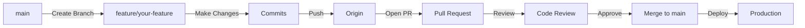

# Contributing to Building Code MCP

## 🌟 Welcome Contributors!

We're excited you're interested in contributing to the Building Code MCP Server! This document outlines our development process and how you can help make construction code compliance accessible to everyone.

## 🔄 GitHub Flow

We use GitHub Flow for all development. It's simple, effective, and perfect for continuous delivery.

### The Flow



### Step-by-Step Process

#### 1. Create a Feature Branch

```bash
# Always branch from main
git checkout main
git pull origin main

# Create your feature branch
git checkout -b feature/icc-api-integration
# OR for bugs
git checkout -b fix/citation-format-error
# OR for docs
git checkout -b docs/api-documentation
```

**Branch Naming Convention:**
- `feature/` - New features
- `fix/` - Bug fixes
- `docs/` - Documentation updates
- `refactor/` - Code refactoring
- `test/` - Test additions/changes
- `chore/` - Maintenance tasks

#### 2. Make Your Changes

```bash
# Make your changes
edit src/tools/icc-api.js

# Stage changes
git add .

# Commit with descriptive message
git commit -m "feat: Add ICC API integration with caching"
```

**Commit Message Format:**
```
<type>: <subject>

<body>

<footer>
```

**Types:**
- `feat`: New feature
- `fix`: Bug fix
- `docs`: Documentation
- `style`: Formatting
- `refactor`: Code restructuring
- `test`: Testing
- `chore`: Maintenance

**Example:**
```
feat: Add ICC API integration

Implements connection to ICC Code Connect API with:
- Authentication handling
- Rate limiting
- Response caching
- Error recovery

Resolves #12
```

#### 3. Push to GitHub

```bash
git push origin feature/icc-api-integration
```

#### 4. Open a Pull Request

1. Go to [GitHub](https://github.com/SamuraiBuddha/building-code-mcp)
2. Click "Compare & pull request"
3. Fill out the PR template
4. Link related issues
5. Request reviewers

#### 5. Code Review

- Address feedback promptly
- Push additional commits to the same branch
- Re-request review when ready

#### 6. Merge

- Once approved, we'll merge using "Squash and merge"
- Delete your feature branch
- Pull latest main locally

## 📋 Pull Request Template

```markdown
## Description
Brief description of changes

## Type of Change
- [ ] Bug fix
- [ ] New feature
- [ ] Breaking change
- [ ] Documentation update

## Testing
- [ ] Unit tests pass
- [ ] Integration tests pass
- [ ] Manual testing completed

## Checklist
- [ ] Code follows style guidelines
- [ ] Self-review completed
- [ ] Comments added for complex code
- [ ] Documentation updated
- [ ] No new warnings

## Related Issues
Closes #(issue number)

## Screenshots (if applicable)
```

## 🧑‍💻 Development Setup

### Prerequisites

- Node.js 18+
- npm or yarn
- Git
- ICC API key (for testing)

### Local Setup

```bash
# Clone the repo
git clone https://github.com/SamuraiBuddha/building-code-mcp.git
cd building-code-mcp

# Install dependencies
npm install

# Copy environment variables
cp .env.example .env
# Edit .env with your API keys

# Run tests
npm test

# Start development server
npm run dev
```

### Testing

```bash
# Run all tests
npm test

# Run specific test suite
npm test -- --grep "ICC API"

# Run with coverage
npm run test:coverage

# Run integration tests
npm run test:integration
```

## 📦 Project Structure

```
building-code-mcp/
├── src/
│   ├── index.js           # MCP server entry point
│   ├── tools/             # MCP tool implementations
│   │   ├── search-code.js
│   │   ├── get-historical.js
│   │   └── format-citation.js
│   ├── scrapers/          # Web scrapers
│   │   ├── nfpa.js
│   │   └── municipal.js
│   ├── api/               # External API clients
│   │   └── icc.js
│   ├── formatters/        # Output formatters
│   │   ├── legal.js
│   │   └── report.js
│   ├── cache/             # Caching logic
│   │   └── redis.js
│   └── utils/             # Utilities
│       ├── logger.js
│       └── validator.js
├── tests/
│   ├── unit/              # Unit tests
│   ├── integration/       # Integration tests
│   └── fixtures/          # Test data
├── docs/                  # Documentation
└── scripts/               # Build/deploy scripts
```

## 🎯 Code Standards

### JavaScript/TypeScript

- ES6+ syntax
- Async/await over promises
- Functional programming where appropriate
- JSDoc comments for all public functions

```javascript
/**
 * Searches for building codes matching the query
 * @param {string} query - Search query
 * @param {Object} options - Search options
 * @param {string} options.jurisdiction - Jurisdiction filter
 * @param {Date} options.date - Historical date
 * @returns {Promise<CodeResult[]>} - Matching code sections
 */
async function searchCodes(query, options = {}) {
  // Implementation
}
```

### Error Handling

```javascript
try {
  const result = await iccAPI.search(query);
  return formatResult(result);
} catch (error) {
  logger.error('ICC API search failed', { error, query });
  
  // Try cache fallback
  const cached = await cache.get(query);
  if (cached) {
    logger.info('Using cached result', { query });
    return cached;
  }
  
  // Throw user-friendly error
  throw new CodeSearchError(
    'Unable to search codes. Please try again.',
    { originalError: error }
  );
}
```

### Testing Standards

- Minimum 80% code coverage
- Test file naming: `*.test.js`
- Use descriptive test names
- Mock external dependencies

```javascript
describe('ICC API Client', () => {
  describe('searchCodes', () => {
    it('should return formatted results for valid query', async () => {
      // Arrange
      const query = 'egress width';
      const mockResponse = { /* ... */ };
      nock('https://api.iccsafe.org')
        .get('/search')
        .reply(200, mockResponse);
      
      // Act
      const result = await iccAPI.searchCodes(query);
      
      // Assert
      expect(result).to.have.property('results');
      expect(result.results).to.have.length.above(0);
    });
  });
});
```

## 🐛 Issue Reporting

### Bug Reports

Use the bug report template:

```markdown
**Describe the bug**
Clear description of the issue

**To Reproduce**
1. Go to '...'
2. Click on '...'
3. See error

**Expected behavior**
What should happen

**Screenshots**
If applicable

**Environment:**
 - OS: [e.g. Windows 11]
 - Node version: [e.g. 18.17.0]
 - MCP version: [e.g. 1.0.0]
```

### Feature Requests

Use the feature request template:

```markdown
**Problem Statement**
What problem does this solve?

**Proposed Solution**
How should it work?

**Alternatives Considered**
Other approaches?

**Additional Context**
Any other information
```

## 🚀 Release Process

1. **Version Bump**
   ```bash
   npm version patch|minor|major
   ```

2. **Changelog Update**
   - Update CHANGELOG.md
   - Follow Keep a Changelog format

3. **Tag Release**
   ```bash
   git tag -a v1.0.1 -m "Release version 1.0.1"
   git push origin v1.0.1
   ```

4. **GitHub Release**
   - Create release from tag
   - Include changelog
   - Attach built artifacts

5. **npm Publish**
   ```bash
   npm publish
   ```

## 🔐 Security

### Reporting Security Issues

**DO NOT** create public issues for security vulnerabilities.

Instead, email security@ehrigbim.com with:
- Description of the vulnerability
- Steps to reproduce
- Potential impact
- Suggested fix (if any)

### Security Best Practices

- Never commit secrets or API keys
- Use environment variables
- Validate all inputs
- Sanitize outputs
- Keep dependencies updated
- Use prepared statements for databases

## 📡 Communication

### Discord
Join our Discord: [Coming Soon]

### Discussions
Use GitHub Discussions for:
- General questions
- Feature ideas
- Community support

### Email
support@ehrigbim.com

## 📋 License

By contributing, you agree that your contributions will be licensed under the MIT License.

## 🙏 Acknowledgments

Thank you to all our contributors!

---

*Happy Coding! 🚀*