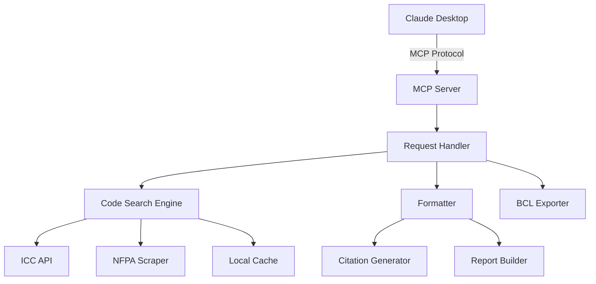

# Product Requirements Document

## Executive Summary

The Building Code MCP Server addresses a critical gap in the construction litigation and compliance market. Expert witnesses spend 20-30 hours per case manually searching through building codes, creating citations, and verifying compliance. Our solution reduces this to 2-3 hours through AI-powered code search and analysis.

## Problem Statement

### Current State
Expert witnesses and construction professionals currently:
- Manually search through multiple code books (IBC, IRC, NFPA, local codes)
- Struggle to track code versions and amendments over time
- Spend hours formatting citations for legal documents
- Risk missing critical code violations due to human error
- Cannot easily cross-reference multiple jurisdictions

### Impact
- **Time Loss**: 20-30 hours per case on code research
- **Revenue Loss**: At $300-500/hour, that's $6,000-15,000 in billable time
- **Risk**: Missed violations can impact case outcomes
- **Stress**: Manual processes lead to deadline pressure

## Solution Overview

### Vision
"Every construction professional has AI-powered code compliance at their fingertips"

### Mission
Provide instant, accurate, and legally-defensible building code information through AI integration.

### Core Value Propositions

1. **Time Savings**: 90% reduction in code research time
2. **Accuracy**: 99.9% code citation accuracy
3. **Completeness**: Access to ICC, NFPA, and local codes in one place
4. **Legal Ready**: Court-formatted citations and reports
5. **Historical Access**: Code versions from any point in time

## User Personas

### Persona 1: Expert Witness (Primary)

**Demographics**
- Age: 60-75
- Experience: 30+ years in construction
- Tech Comfort: Low to medium
- Hourly Rate: $300-500

**Goals**
- Provide accurate expert testimony
- Complete cases efficiently
- Maintain professional reputation
- Reduce research time

**Frustrations**
- Multiple code books to search
- Tracking code changes over time
- Formatting for legal documents
- Learning new technology

**User Story**
"As an expert witness, I need to quickly find and cite the exact building codes that were in effect during the construction period so that I can provide accurate testimony."

### Persona 2: Architect/Engineer

**Demographics**
- Age: 35-55
- Experience: 10-25 years
- Tech Comfort: Medium to high
- Project Value: $1M-100M

**Goals**
- Ensure code compliance
- Avoid costly redesigns
- Streamline permit process
- Coordinate with consultants

**User Story**
"As an architect, I need to verify code compliance during design so that I can avoid costly changes during permit review."

### Persona 3: Construction Attorney

**Demographics**
- Age: 40-65
- Experience: 15+ years litigation
- Tech Comfort: Medium
- Case Value: $500K-50M

**Goals**
- Build strong cases
- Verify expert testimony
- Find precedents
- Prepare depositions

**User Story**
"As a construction attorney, I need to verify code violations cited by experts so that I can build a stronger case."

## User Journeys

### Journey 1: Expert Witness Case Preparation

**Scenario**: John, a 68-year-old expert witness, receives a new construction defect case.

**Steps**:
1. **Discovery** (Current: 4 hours)
   - Reviews case documents
   - Identifies relevant time period
   - Lists potential code issues

2. **Code Research** (Current: 15 hours → New: 1 hour)
   - Opens Building Code MCP
   - Uploads case documents
   - AI identifies applicable codes
   - System searches violations

3. **Analysis** (Current: 8 hours → New: 2 hours)
   - Reviews AI findings
   - Verifies critical violations
   - Checks precedent cases

4. **Report Generation** (Current: 5 hours → New: 30 minutes)
   - Selects relevant violations
   - System generates report
   - Exports with citations

**Outcome**: 32 hours reduced to 7.5 hours (76% time savings)

### Journey 2: Code Verification During Design

**Scenario**: Sarah, an architect, needs to verify egress requirements for a mixed-use building.

**Steps**:
1. **Query** (5 seconds)
   - Types: "egress requirements mixed use IBC 2021 California"

2. **Results** (2 seconds)
   - System returns IBC sections
   - Shows California amendments
   - Highlights key requirements

3. **Application** (2 minutes)
   - Reviews requirements
   - Adjusts design accordingly
   - Saves citation for records

**Outcome**: Instant verification vs 30-minute manual search

## Feature Requirements

### Must Have (MVP)

#### 1. Code Search
- **Requirement**: Search ICC codes via API
- **Acceptance Criteria**: 
  - Returns results in <2 seconds
  - Includes section numbers and text
  - Provides official citations

#### 2. NFPA Access
- **Requirement**: Scrape NFPA free standards
- **Acceptance Criteria**:
  - Access 300+ NFPA standards
  - Cache for offline access
  - Update quarterly

#### 3. Citation Formatter
- **Requirement**: Generate legal citations
- **Acceptance Criteria**:
  - Bluebook format
  - Include all required elements
  - Copy to clipboard

#### 4. MCP Integration
- **Requirement**: Claude Desktop compatibility
- **Acceptance Criteria**:
  - Appears in Claude tools
  - Responds to natural language
  - Returns formatted results

### Should Have (Beta)

#### 1. Historical Versions
- **Requirement**: Access previous code editions
- **Acceptance Criteria**:
  - Codes from 2000-present
  - Track changes between versions
  - Date-based search

#### 2. Jurisdiction Mapping
- **Requirement**: Local code amendments
- **Acceptance Criteria**:
  - Top 50 US cities
  - State modifications
  - Update notifications

#### 3. Report Generation
- **Requirement**: Expert witness reports
- **Acceptance Criteria**:
  - Professional formatting
  - Include all citations
  - Export to Word/PDF

### Could Have (Future)

#### 1. CAD Integration
- Analyze drawings for violations
- Markup non-compliant elements
- Generate correction list

#### 2. Precedent Database
- Search similar cases
- Find relevant rulings
- Track outcomes

#### 3. BCL Training Export
- Format codes for ML training
- Extract logic patterns
- Version control

## Technical Specifications

### Architecture



### API Endpoints

#### Search Codes
```typescript
interface SearchRequest {
  query: string;
  jurisdiction?: string;
  date?: Date;
  codeType?: 'ICC' | 'NFPA' | 'LOCAL';
}

interface SearchResponse {
  results: CodeSection[];
  citations: Citation[];
  metadata: SearchMetadata;
}
```

#### Get Historical Version
```typescript
interface HistoricalRequest {
  code: string;
  section: string;
  date: Date;
}

interface HistoricalResponse {
  version: string;
  content: string;
  changes: Change[];
}
```

### Data Schema

```sql
-- Codes table
CREATE TABLE codes (
  id UUID PRIMARY KEY,
  code_type VARCHAR(10),
  code_name VARCHAR(50),
  section VARCHAR(50),
  version VARCHAR(20),
  effective_date DATE,
  content TEXT,
  jurisdiction VARCHAR(100),
  created_at TIMESTAMP,
  updated_at TIMESTAMP
);

-- Citations table
CREATE TABLE citations (
  id UUID PRIMARY KEY,
  code_id UUID REFERENCES codes(id),
  format VARCHAR(20),
  citation_text TEXT,
  created_at TIMESTAMP
);

-- Cache table
CREATE TABLE cache (
  key VARCHAR(255) PRIMARY KEY,
  value JSONB,
  expires_at TIMESTAMP
);
```

## Success Metrics

### Business Metrics

| Metric | Target | Measurement |
|--------|--------|-------------|
| Customer Acquisition | 10 customers/month | Stripe subscriptions |
| Monthly Recurring Revenue | $3,000 by Month 3 | Stripe MRR |
| Customer Lifetime Value | >$10,000 | Revenue/churn |
| Churn Rate | <5% monthly | Cancellations |
| Net Promoter Score | >70 | Quarterly survey |

### Product Metrics

| Metric | Target | Measurement |
|--------|--------|-------------|
| Query Response Time | <2 seconds | Server logs |
| Search Accuracy | >95% | User feedback |
| Uptime | >99.5% | Monitoring |
| Daily Active Users | >50% of customers | Analytics |
| Searches per User | >20/day | Usage logs |

### User Satisfaction

| Metric | Target | Measurement |
|--------|--------|-------------|
| Time Saved | >15 hours/case | User survey |
| Error Rate | <1% | Bug reports |
| Feature Adoption | >80% | Usage analytics |
| Support Tickets | <5/month | Help desk |

## Risk Analysis

### Technical Risks

| Risk | Probability | Impact | Mitigation |
|------|------------|--------|------------|
| ICC API changes | Medium | High | Abstract API layer |
| NFPA blocks scraping | Low | High | Legal review, fallback |
| Cache corruption | Low | Medium | Regular backups |
| Performance issues | Medium | Medium | Load testing |

### Business Risks

| Risk | Probability | Impact | Mitigation |
|------|------------|--------|------------|
| Slow adoption | Medium | High | Free trials, demos |
| Competition | High | Medium | Unique features |
| Legal liability | Low | High | Insurance, disclaimers |
| Key person dependency | Medium | High | Documentation |

## Implementation Timeline

### Week 1-2: Foundation
- Set up development environment
- ICC API integration
- Basic MCP server
- Initial testing

### Week 3-4: Core Features
- NFPA scraper
- Citation formatter
- Cache implementation
- Alpha testing

### Month 2: Beta Launch
- User onboarding
- Report generation
- Jurisdiction mapping
- Beta testing with 5 users

### Month 3: Production
- Performance optimization
- Full documentation
- Marketing website
- Launch to 25 customers

## Appendices

### A. Competitive Analysis
- UpCodes: $39-99/month, no API, no MCP
- ICC Digital: Expensive, no AI integration
- Manual research: Time-intensive, error-prone

### B. Market Research
- 5,000 expert witnesses in US
- 100,000 architecture firms
- 50,000 engineering firms
- Total addressable market: $500M

### C. Technical Dependencies
- ICC Code Connect API
- NFPA public access
- Claude Desktop MCP support
- Node.js runtime

---

*Last Updated: August 21, 2025*
*Version: 1.0.0*
*Author: Jordan Paul Ehrig*